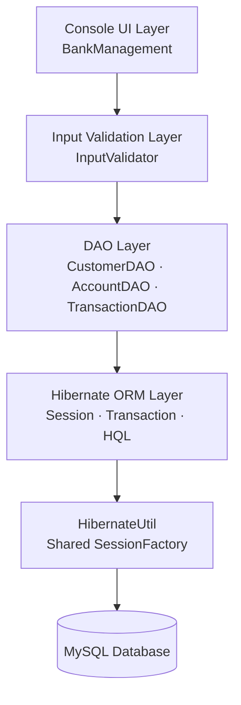
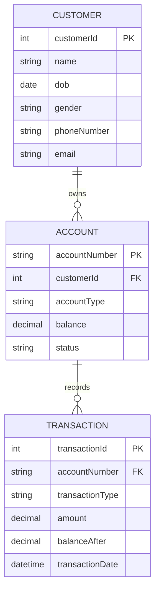

<div align="center">

# 🏦 Bank Management System

### A Console-Based Banking Application built with Java, Hibernate & MySQL

[](https://www.oracle.com/java/)
[](https://hibernate.org/)
[](https://www.mysql.com/)
[](https://maven.apache.org/)
[](#-roadmap--status)
[](LICENSE)

</div>

---

## 📌 Overview

**Bank Management System** is a console-based banking application built with **Java, Hibernate ORM (JPA), and MySQL**. It simulates core banking operations — customer registration, account management, deposits, withdrawals, transfers, PIN management, and transaction history.

The project follows the **DAO (Data Access Object) pattern**, uses a centralized `HibernateUtil` for a shared `SessionFactory`, and applies Hibernate transactions to keep operations like fund transfers atomic.

> 🎯 **Objective:** Build a backend-focused banking application demonstrating Java, Hibernate, relational database design, transaction management, and clean code organization.

> ✅ **Status:** The current planned scope is complete. Development is paused while I move on to new backend projects.

---

## 📋 Table of Contents

- [Features](#-features)
- [Tech & Concepts](#-tech--concepts)
- [Architecture](#-architecture)
- [Entity Relationship](#-entity-relationship)
- [Getting Started](#-getting-started)
- [Usage](#-usage)
- [Roadmap & Status](#-roadmap--status)
- [Feedback](#-feedback)
- [License](#-license)

---

## ✨ Features

- Customer registration & lookup
- Account creation (Savings / Current) & lookup
- Deposit, withdraw, and fund transfer with PIN verification
- Atomic transfers using Hibernate transactions (commit/rollback)
- Transaction history via HQL
- PIN change
- Centralized Hibernate config with shared `SessionFactory`

**🔐 Security Note:** Passwords and PINs are stored as plain values for learning purposes — hashing is planned for a future version.

---

## 🛠 Tech & Concepts

**Stack:** Java 25 · Hibernate ORM · JPA · MySQL 8 · Maven · Git

**Java:** OOP (encapsulation, enums), exception handling, `List`, `LocalDate`/`LocalDateTime`, try-with-resources, regex, input validation, DAO pattern

**Hibernate:** `SessionFactory` & `Session`, `persist`/`find`/`merge`, transactions (commit/rollback), HQL queries, dirty checking

---

## 🏗 Architecture



```
BankManagementSystem/
├── Database/schema.sql
├── src/main/java/com/shubham/
│   ├── Account.java, AccountDAO.java
│   ├── Customer.java, CustomerDAO.java
│   ├── bankTransaction.java, TransactionDAO.java
│   ├── HibernateUtil.java, InputValidator.java
│   └── BankManagement.java, Main.java
├── src/main/resources/hibernate.cfg.xml
└── pom.xml
```

---

## 🔗 Entity Relationship



---

## 🚀 Getting Started

**Prerequisites:** JDK 25 · MySQL 8+ · Maven · IntelliJ IDEA (or any Java IDE)

```bash
# 1. Clone
git clone https://github.com/dev-jshubham/bank-management-system.git
cd bank-management-system

# 2. Create an empty database
# CREATE DATABASE project2_bms;
# (Hibernate will auto-create the tables on first run)

# 3. Configure Hibernate — update src/main/resources/hibernate.cfg.xml
#    with your DB URL, username, and password

# 4. Install dependencies
mvn clean install

# 5. Run
# src/main/java/com/shubham/Main.java
```

> ⚠️ Never commit real database credentials to GitHub.

---

## 💻 Usage

```
========== BANK MANAGEMENT SYSTEM ==========
1. Register Customer      6. Withdraw Money
2. View Customer          7. Transfer Money
3. Open Account            8. View History
4. View Account            9. Change PIN
5. Deposit Money           10. Exit
```

**Transfer flow** (all steps run inside a single Hibernate transaction, rolled back on failure):

```
Sender & Receiver Account → Verify Both Accounts → Verify Sender PIN
   → Update Sender Balance → Update Receiver Balance
   → Record TRANSFER_OUT & TRANSFER_IN → Commit
```

Deposit and Withdraw follow the same pattern: **validate → update balance → record transaction → commit**.

---

## 🗺 Roadmap & Status

| Stage | Description | Status |
|---|---|---|
| 1 | Model classes (Customer, Account, BankTransaction) | ✅ |
| 2 | JDBC + MySQL integration (DAO layer) | ✅ |
| 3 | Core banking logic — deposit, withdraw, transfer | ✅ |
| 4 | Hibernate ORM migration & DAO refactoring | ✅ |
| 5 | PIN management & transaction history | ✅ |
| — | Admin panel, password/PIN hashing, login, REST API | 💭 Future |

---

## 💬 Feedback

This is a personal learning project focused on Java backend development, Hibernate ORM, and database design. Feedback and suggestions are welcome via [GitHub Issues](https://github.com/dev-jshubham/bank-management-system/issues).

---

## 📄 License

Licensed under the **MIT License** — see [LICENSE](LICENSE) for details.

<div align="center">

### ⭐ If you found this project useful, consider giving it a star!

Made with ☕ and Java

</div>