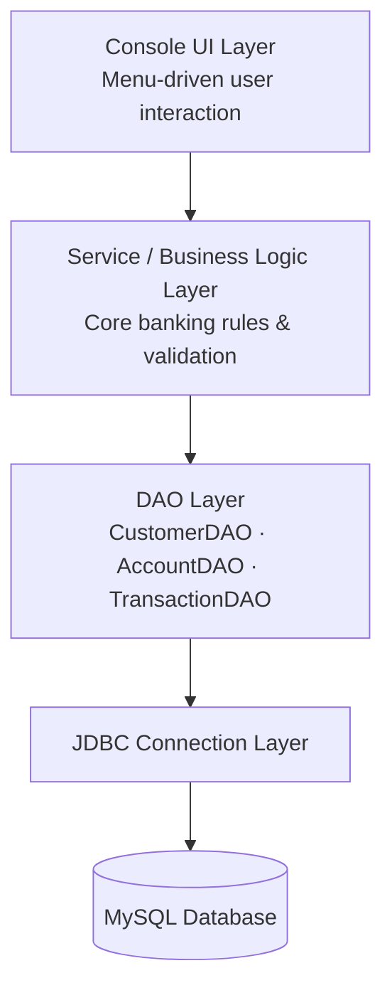
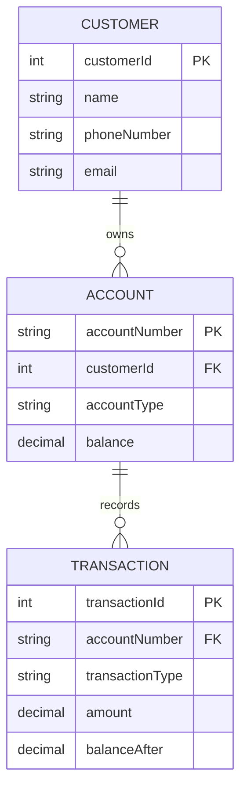

<div align="center">

# 🏦 Bank Management System

### A Console-Based Banking Application built with Java, JDBC & MySQL

[](https://www.oracle.com/java/)
[](https://www.mysql.com/)
[](#-roadmap--current-status)
[](#-roadmap--current-status)
[](LICENSE)

</div>

---

## 📌 Overview

**Bank Management System** is a console-based banking application built using **Java**, **JDBC**, and **MySQL**. It simulates real-world banking operations — customer onboarding, account management, deposits, withdrawals, and fund transfers — while following **object-oriented design principles** and a **layered architecture** based on the **DAO (Data Access Object) pattern**.

All customer, account, and transaction data is persisted in a relational MySQL database.

> 🎯 **Objective:** To build a backend-focused banking application that demonstrates database integration, data integrity, robust exception handling, and clean, maintainable code organization using core Java.
>
> This is an active learning project — see [Current Status](#-roadmap--current-status) below for what's implemented vs. planned.

---

## 📋 Table of Contents

- [Features](#-features)
- [Tech Stack](#-tech-stack)
- [Architecture](#-architecture)
- [Database Schema](#-database-schema)
- [Getting Started](#-getting-started)
- [Usage](#-usage)
- [Java Concepts Used](#-java-concepts-used)
- [Skills Demonstrated](#-skills-demonstrated)
- [Learning Outcomes](#-learning-outcomes)
- [Roadmap & Current Status](#-roadmap--current-status)
- [Feedback](#-feedback)
- [License](#-license)

---

## ✨ Features

### ✅ Implemented

- Customer registration with core details (name, DOB, contact, ID proof)
- Account creation linked to a customer (Savings / Current)
- Normalized relational schema — `Customer → Account → Transaction` with foreign keys
- DAO layer for Customer, Account, and Transaction persistence
- View account details and balance
- Deposit, withdrawal, and fund transfer logic (atomic — commit/rollback)
- Transaction history / statement generation

### 🔜 In Progress / Planned

- Admin panel for managing customers and accounts
- Login authentication with hashed passwords *(not yet implemented — see note below)*

> **Note on security fields:** the schema includes `Password` column for future authentication. These are **not yet hashed/encrypted** — that's part of the upcoming work, not a claim about the current state.

---

## 🛠 Tech Stack

<p align="left">


</p>

---

## 🏗 Architecture

The project follows a **layered architecture** built around the **DAO (Data Access Object) pattern**, separating presentation, business logic, and data access.



**Project Structure:**
```
BankManagementSystem/
│
├── Database/
│   └── schema.sql
│
├── src/
│   ├── Account.java
│   ├── AccountDAO.java
│   ├── BankManagement.java
│   ├── Customer.java
│   ├── CustomerDAO.java
│   ├── DBConnection.java
│   ├── Main.java
│   ├── Transaction.java
│   └── TransactionDAO.java
│
├── .gitignore
└── README.md
```

---

## 🗃 Database Schema

### Customer

| Column | Description |
|---------|-------------|
| Customer ID | Primary key, auto-generated |
| Name | Full name of the customer |
| Date of Birth | Customer's DOB |
| Gender | Customer's gender |
| Phone Number | Unique contact number |
| Email | Customer's email address |
| Address | Residential address |
| ID Proof Type | Type of identification document |
| ID Proof Number | Unique identification number |
| Password | Login credential *(plaintext currently — hashing planned)* |
| Registration Date | Customer registration timestamp |
| Active Status | Indicates whether the customer account is active |

### Account

| Column | Description |
|---------|-------------|
| Account Number | Primary key |
| Customer ID | Foreign key referencing **Customer** |
| Account Type | Savings / Current |
| Balance | Current account balance |
| Status | Active / Blocked / Closed |
| Opened Date | Account opening timestamp |
| PIN | Transaction PIN *(plaintext currently — hashing planned)* |

### Transaction

| Column | Description |
|---------|-------------|
| Transaction ID | Primary key, auto-generated |
| Account Number | Foreign key referencing **Account** |
| Transaction Type | Deposit / Withdraw / Transfer In / Transfer Out |
| Amount | Transaction amount |
| Balance After | Account balance after the transaction |
| Transaction Date | Timestamp of the transaction |

---

## 🔗 Entity Relationship


---

## 🚀 Getting Started

### Prerequisites
- Java Development Kit (JDK 17 or higher)
- MySQL Server (8.0+)
- IntelliJ IDEA / Eclipse / any Java IDE
- MySQL Connector/J (JDBC Driver)

---

## 🚀 Installation

### 1. Clone the repository

```bash
git clone https://github.com/dev-jshubham/bank-management-system.git
cd bank-management-system
```

### 2. Set up the database

Open **MySQL Workbench** (or any MySQL client) and execute the `Database/schema.sql` file to create the database and required tables.

### 3. Configure the database connection

Rename `DBConnectionExample.java` to `DBConnection.java`, then update the database credentials according to your local MySQL setup.

```java
private static final String URL = "jdbc:mysql://localhost:3306/project2_bms";
private static final String USER = "your_mysql_username";   // e.g., root
private static final String PASSWORD = "your_password";
```

### 4. Add the MySQL JDBC Driver

Add the **MySQL Connector/J (JDBC Driver)** to your project if it is not already configured.

### 5. Open the project

Open the project in **IntelliJ IDEA** (or any Java IDE).

### 6. Run the application

Run the `Main.java` class to start the **Bank Management System**.

---

## 💻 Usage

Once launched, the application presents a menu-driven console interface:

```
====== BANK MANAGEMENT SYSTEM ======
1. Register New Customer
2. Open New Account
3. Deposit Money
4. Withdraw Money
5. Transfer Funds
6. View Account Details
7. View Transaction History
8. Exit
=====================================
Enter your choice:
```

> Menu options 3–5 and 7 reflect the target feature set; see [Roadmap](#-roadmap--current-status) for what's live today.

---

## 🧠 Java Concepts Used

- **Object-Oriented Programming (OOP)** — Classes & Objects, Encapsulation, Inheritance
- **Exception Handling** — Custom & built-in exceptions for robust error management
- **JDBC API**
    - `PreparedStatement` for parameterized, injection-safe queries
    - `ResultSet` for processing query results
    - `Try-with-Resources` for automatic resource management
- **Layered Architecture** with the **DAO Pattern** for clean separation of concerns

---

## 🎯 Skills Demonstrated

- Backend Development
- Database Design & Normalization
- SQL Query Writing
- JDBC Integration
- Exception Handling
- DAO Design Pattern
- Relational Database Management
- Version Control with Git

---

## 📚 Learning Outcomes

Through this project, the following practical skills were developed:

- Designing normalized relational databases with proper foreign keys
- Connecting Java applications to MySQL using JDBC
- Performing CRUD operations through JDBC
- Organizing code using the DAO design pattern
- Writing modular, maintainable backend code
- Handling SQL and Java exceptions effectively

---

## 🗺 Roadmap & Current Status

| Stage | Description | Status |
|---|---|---|
| 1 | Model classes — Customer, Account, Transaction | ✅ Completed |
| 2 | JDBC + MySQL integration (DAO layer) | ✅ Completed |
| 3 | Core banking logic — deposit, withdraw, transfer with rollback | ✅ Completed |
| 4 | Admin panel & reporting | 🔄 In Progress |
| 5 | Password/PIN hashing | 🔜 Planned |
| 6 | Unit testing with JUnit | 🔜 Planned |
| — | GUI (JavaFX/Swing) or REST API (Spring Boot) | 💭 Future idea |

---

## 💬 Feedback

This is a personal learning project built to practice backend fundamentals. Suggestions, code review, or feedback are welcome via [Issues](https://github.com/dev-jshubham/bank-management-system/issues) — I'm actively iterating on it.

---

## 📄 License

This project is licensed under the **MIT License** — see the [LICENSE](LICENSE) file for details.

---

<div align="center">

### ⭐ If you found this project useful, consider giving it a star!

Made with ☕ and Java

</div>